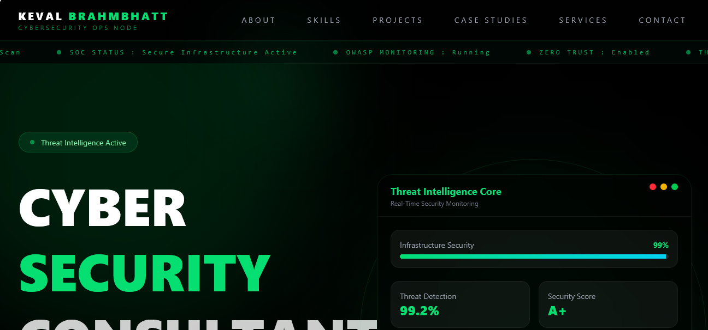

# Hackedbykvl.github.io

# Cybersecurity Consultant Portfolio

Professional cybersecurity consultant portfolio showcasing expertise in ISO 27001 compliance, IT auditing, cybersecurity consulting, vulnerability assessments, risk management, and digital trust.

🔗 Live Portfolio: https://hackdbykvl.github.io/cybersecurity-portfolio/

---

## Overview

This portfolio represents my professional cybersecurity consulting identity and demonstrates capabilities in:

* Cybersecurity Consulting
* ISO 27001 Compliance
* Information Security Governance
* IT Auditing
* Vulnerability Assessment
* Risk Assessment
* OWASP ZAP Security Testing
* Security Documentation
* Digital Trust & Compliance

---

## Portfolio Preview

The portfolio features a futuristic cybersecurity-inspired interface including:

* Interactive Cyber Terminal
* Security Metrics Dashboard
* Network Graph Visualization
* Radar Sweep Scanner
* Case Study Showcase
* Cybersecurity Consulting Services
* Secure Contact System
* Resume Download
* Threat Intelligence Visualizations

---

## Features

### Professional Portfolio

* Modern cybersecurity-themed design
* Fully responsive layout
* Professional consultant branding
* Optimized GitHub Pages deployment
* Smooth animations and transitions

### Cybersecurity Services

* Cybersecurity Consulting
* Compliance Readiness Support 
* Risk Assessment 
* Security Reviews 
* Vulnerability Assessment 
* IT Audit Support 

### Interactive Cyber Terminal 

Built-in command terminal featuring: 

* help 
* whoami 
* skills 
* certs 
* projects 
* casestudies 
* services 
* contact 
* clear 

### Security Metrics Dashboard 

Includes: 

* Security Integrity Indicators 
* Compliance Monitoring Concepts 
* Threat Intelligence Visualizations 
* Interactive Security Components

### Advanced Threat Intelligence Visualizations

* Live-style Security Dashboard
* Network Node Visualization
* Threat Intelligence UI
* Security Monitoring Concepts
* Interactive Cyber Components

### Advanced Visual Effects

* Network Graph Animation
* Radar Sweep Scanner
* Cyber Grid Backgrounds
* Scanline Effects
* Neon Security UI Elements
* Animated Security Nodes

### Case Studies

Featured cybersecurity projects including:

* Enterprise ISO 27001 Gap Analysis
* OWASP Top 10 Vulnerability Simulation
* Security Compliance Monitoring System

### Contact System 

* Secure Contact Form 
* Web3Forms Integration 
* LinkedIn Integration 
* GitHub Integration 
* Professional Communication Channel 

### Resume Download 

Professional cybersecurity consultant resume download functionality. 

---

## Technology Stack 

### Frontend 

* React 
* Quickly 
* JavaScript 

### Styling 

* Tailwind CSS 

### Animations 

* Framer Motion 

### Forms 

* Web3Forms 

### Hosting 

* GitHub Pages 

---

## Featured Expertise 

### Governance, Risk & Compliance (GRC) 

* ISO 27001 
* Security Compliance 
* Risk Management 
* IT Auditing 
* Policy Development 

### Security Testing 

* OWASP ZAP 
* Vulnerability Assessment 
* Security Reviews 
* Attack Surface Analysis 

### Security Operations 

* Threat Intelligence 
* Security Monitoring 
* Security Documentation 
* Compliance Tracking 

---

## Connect 

### LinkedIn 

https://www.linkedin.com/in/keval-brahmbhatt-108a49121 

### GitHub 

https://github.com/hackdbykvl 

### Portfolio 

https://hackdbykvl.github.io/cybersecurity-portfolio/ 

---

## Author 

**Keval Brahmbhatt **

Cybersecurity Consultant 

Focused on Cybersecurity, ISO 27001 Compliance, IT Auditing, Risk Assessment, Vulnerability Assessment, and Digital Trust. 

---

## License 

This project is available for portfolio and professional showcase purposes. 

© 2026 Keval Brahmbhatt 
